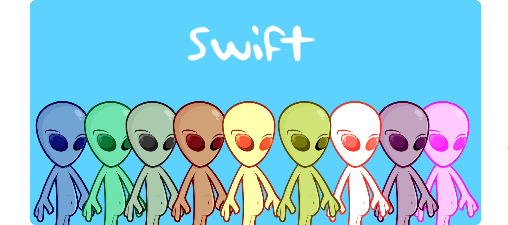

# Swift NFTs

Swift is a collection of unique Aliens living on the Ethereum blockchain. They are all automatically generated using diffrent attributes, assuring that every Swift NFT is 100% unique!

Check-out Swift: [The Dapp](https://swiftnft.netlify.app/)

<p align="center" display="inline-block">
  
</p>

Swift is composed of :
* [Swift Generator](./Swift_generator):
This is used to generate the actual NFTs
* [Swift](./landing-page):
The front end part of the project.

## How to use the project:

```
git clone https://github.com/OnsJannet/Swift-NFTs.git
yarn install
```

## Author :black_nib:

* **Ons Jannet** <[OnsJannet](https://github.com/OnsJannet)>
